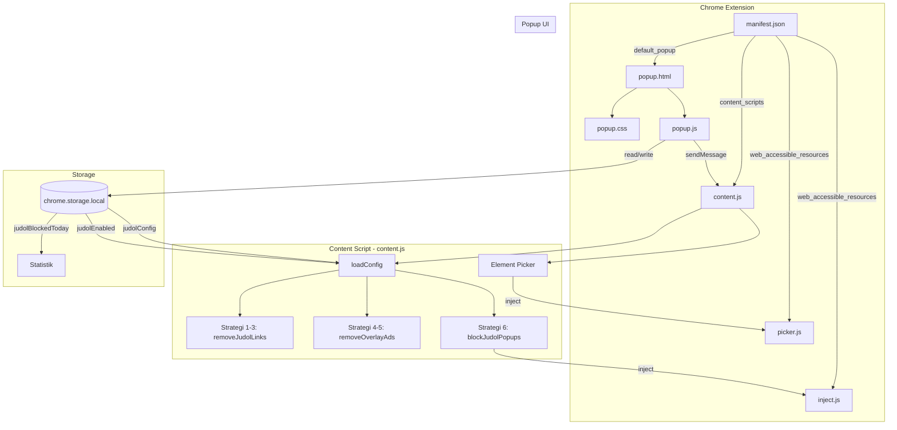

# Arsitektur — Remove Judol Ads

## Overview

Ekstensi Chrome (Manifest V3) yang memblokir iklan judi online dengan multi-layer approach.

## Diagram Alur



## Komponen Utama

### 1. `content.js` — Content Script (Core)

- Dijalankan di `document_start` pada semua halaman
- **Instant CSS Hide**: menyembunyikan container iklan sebelum render
- **removeJudolLinks()**: hapus `<a>` berisi `` yang link-nya mencurigakan
- **removeOverlayAds()**: hapus overlay/popup/fixed div iklan
- **blockJudolPopups()**: inject `inject.js` untuk intercept `window.open`
- **MutationObserver**: monitor DOM untuk konten dinamis

### 2. `inject.js` — Page Context Script

- Dijalankan dalam konteks halaman (bukan isolated world)
- Override `window.open`, `document.createElement`, event listeners
- Mencegah popup dan redirect ke situs judol

### 3. `picker.js` — Element Picker

- Visual element selector mirip Chrome DevTools inspect
- Highlight elemen saat hover, capture saat click
- Ekstrak URL dari href, src, dan atribut lainnya
- Otomatis kategorikan ke keywords/TLD/domain/shortener

### 4. `popup.html/css/js` — Popup UI

- Toggle aktif/nonaktif
- Statistik pemblokiran harian
- Tab management: Keywords, TLD, Domain IMG, Shortener
- CRUD operasi untuk setiap kategori filter
- Reset ke default

## Strategi Pemblokiran

| #   | Strategi            | Target                                                   |
| --- | ------------------- | -------------------------------------------------------- |
| 1   | Keyword matching    | Hostname mengandung keyword judol                        |
| 2   | TLD filtering       | Domain dengan TLD mencurigakan (.xyz, .click, dll)       |
| 3   | Image domain        | Gambar dari domain iklan (blogger.googleusercontent.com) |
| 4   | Shortener detection | URL shortener (bit.ly, s.id, dll)                        |
| 5   | Overlay removal     | Fixed div dengan z-index tinggi + konten iklan           |
| 6   | Popup blocking      | Intercept window.open ke URL mencurigakan                |

## Data Flow

```
User menambah rule di Popup
    → chrome.storage.local.set()
    → sendMessage("configUpdated")
    → content.js loadConfig()
    → removeAllAds() + updateInjectedConfig()
```
